```mermaid
architecture-beta
    service server(mdi:server) [SERVER]
    service route(mdi:routes) [ROUTE]
    service controller(mdi:application-braces-outline) [CONTROLLER]
    service _service(mdi:resource-description-framework) [SERVICE]
    service repository(mdi:source-repository-multiple) [REPOSITORY]
    server:R --> L:route
    route:R --> L:controller
    controller:R --> L:_service
    _service:R --> L:repository
```

## Descripción y propósito del proyecto
Monolito (API REST) de Backend de e-commerce B2C (MVP) orientado a la venta de amigurumis y productos relacionados con el crochet.
###### [Reglas del Negocio](./docs/reglas_de_negocio.md) | [Diagrama ER](./docs/diagramaER.md) | [Alcance Funcional](./docs/alcance.md) | [Estructura de carpetas](./docs/estructura.md) | [Roles](./docs/roles.md)

## Arquitectura
**MVC con Clean Architecture ligera:**

- **SERVER:** Punto de entrada de la aplicación.
- **ROUTES:** Definen rutas y agrupación por recurso.
- **CONTROLLERS:** Reciben la solicitud, llaman al servicio y devuelven la respuesta.
- **SERVICES:** Contienen y aplican la lógica de negocio.
- **REPOSITORIES:** Acceden a los datos de la base de datos vía Prisma.

###### Fuente de íconos: https://icon-sets.iconify.design/

## Stack Tecnológico
- **Gestor de versiones:** Git
- **Entorno de ejecución:** Node.js
- **Gestor de dependencias:** pnpm
- **Lenguaje de programación:** JavaScript (+TypeScript)
- **Framework de desarrollo web:** Express.js
- **Base de datos relacional:** PostgreSQL
- **ORM:** Prisma
- **Gestor de migraciones:** Prisma Migrate
- **Plataforma para backend en la nube:** Render
- **Plataforma para base de datos en la nube:** Supabase
  ###### [Paquetes de Terceros](./docs/paquetes.md)

## Instrucciones de Despliegue
1. Se debe...

   ###### [Seeds de datos](./docs/seeds.md) | [Endpoints](./docs/endpoints.md)

---
---

**Terminología**
- **Amigurumi:** Peluches japoneses tejidos a crochet.
- **API REST:** Application Programming Interface - Representational State Transfer.
- **B2C:** Business To Consumer.
- **MVC:** Model View Controller.
- **MVP:** Minimum Viable Product.

---
---