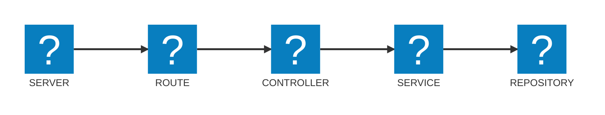

# 🧶 Shop MVP — API E-commerce de Amigurumis

Monolito **API REST** para un e-commerce B2C especializado en amigurumis y productos relacionados con el crochet. Proyecto tipo **MVP**, construido con foco en buenas prácticas de arquitectura backend (separación por capas, seguridad de autenticación, validación de datos).

> 💡 Este repositorio es el **núcleo del proyecto** (backend). Existe un [frontend demostrativo](https://github.com/Carlos-Eduardo-17/shop-mvp-front) que consume esta API únicamente para fines de presentación visual; toda la lógica de negocio, seguridad y buenas prácticas se concentran aquí.

---

## 📌 Estado del proyecto

Este MVP está **funcional pero en construcción activa**. A la fecha:

| Módulo | Estado |
|---|---|
| Registro / Login / Logout / Refresh Token | ✅ Implementado |
| Perfil de usuario autenticado | ✅ Implementado |
| Catálogo de productos y categorías (lectura) | ✅ Implementado |
| Carrito de compras | 🚧 Modelado en la base de datos, pendiente de implementar en la API |
| Checkout / Órdenes | 🚧 Modelado en la base de datos, pendiente de implementar en la API |

El detalle de qué entra y qué no en esta versión está en [`docs/alcance.md`](./docs/alcance.md).

---

## 📚 Documentación relacionada

| Documento | Contenido |
|---|---|
| [`docs/reglas_de_negocio.md`](./docs/reglas_de_negocio.md) | Reglas y restricciones del dominio |
| [`docs/roles.md`](./docs/roles.md) | Permisos por tipo de usuario |
| [`docs/alcance.md`](./docs/alcance.md) | Qué incluye y qué no incluye el MVP |
| [`docs/diagramaER.md`](./docs/diagramaER.md) | Diagrama entidad-relación de la base de datos |
| [`docs/estructura.md`](./docs/estructura.md) | Convenciones de cada carpeta del código fuente |
| [`docs/paquetes.md`](./docs/paquetes.md) | Justificación de cada dependencia usada |
| [`docs/endpoints.md`](./docs/endpoints.md) | Referencia completa de la API |
| [`docs/seeds.md`](./docs/seeds.md) | Datos de prueba precargados |

---

## 🏗️ Arquitectura

**MVC con Clean Architecture ligera** (separación estricta de responsabilidades por capa):


```mermaid
architecture-beta
    service server(mdi:server) [SERVER]
    service route(mdi:routes) [ROUTE]
    service controller(mdi:application-braces-outline) [CONTROLLER]
    service _service(mdi:resource-description-framework) [SERVICE]
    service repository(mdi:source-repository-multiple) [REPOSITORY]
    server:R --> L:route
    route:R --> L:controller
    controller:R --> L:_service
    _service:R --> L:repository
```

- **Server** → punto de arranque de la app Express (`src/server.ts`, `src/index.ts`).
- **Routes** → definen endpoints y conectan middlewares (`src/routes`).
- **Controllers** → reciben la petición HTTP, delegan al service y responden (`src/controllers`).
- **Services** → lógica de negocio pura, sin conocer HTTP ni la DB directamente (`src/services`).
- **Repositories** → único punto de acceso a la base de datos vía Prisma (`src/repositories`).

Cada capa solo conoce a la inmediatamente inferior (regla de dependencia unidireccional), lo que facilita testear y reemplazar piezas sin romper el resto. Detalle completo en [`docs/estructura.md`](./docs/estructura.md).

---

## 🗄️ Modelo de datos

Entidades principales: `User`, `Category`, `Product`, `Cart`, `CartItem`, `Order`, `OrderDetail`.

Diagrama y cardinalidades completas en [`docs/diagramaER.md`](./docs/diagramaER.md).

---

## 🛠️ Stack tecnológico

| Categoría | Tecnología |
|---|---|
| Entorno de ejecución | Node.js |
| Lenguaje | TypeScript |
| Framework web | Express.js 5 |
| Base de datos | PostgreSQL |
| ORM | Prisma (con driver adapter `pg`) |
| Autenticación | JWT (access + refresh token) en cookies `httpOnly` |
| Validación | express-validator |
| Seguridad de headers | Helmet |
| Rate limiting | express-rate-limit |
| Hash de contraseñas | bcrypt |
| Gestor de paquetes | pnpm |
| Hosting sugerido | Render (API) + Supabase (PostgreSQL) |

Justificación de cada paquete en [`docs/paquetes.md`](./docs/paquetes.md).

---

## 🔌 Endpoints principales

Resumen rápido — referencia completa (bodies, respuestas y errores) en [`docs/endpoints.md`](./docs/endpoints.md).

| Método | Endpoint | Auth | Descripción |
|---|---|---|---|
| GET | `/api/health` | No | Estado del servicio |
| POST | `/api/users/register` | No | Crea una cuenta |
| POST | `/api/users/login` | No | Inicia sesión (setea cookies) |
| POST | `/api/users/refresh` | Cookie refresh | Renueva el access token |
| GET | `/api/users/me` | Sí | Perfil del usuario autenticado |
| POST | `/api/users/logout` | Sí | Cierra sesión e invalida el refresh token |
| GET | `/api/categories` | No | Lista de categorías |
| GET | `/api/products` | No | Lista de productos (todos, o filtrados con `?categoryId=`) |
| GET | `/api/products/:id` | No | Detalle de un producto |

---

## 🔐 Seguridad implementada

- **Contraseñas**: hasheadas con `bcrypt`, nunca se almacenan ni se retornan en texto plano.
- **Sesión**: access token (15 min) + refresh token (7 días) rotados y firmados con `jsonwebtoken`, entregados en cookies `httpOnly`, `sameSite=strict` y `secure` en producción — no accesibles desde JavaScript del cliente.
- **Revocación de sesión**: el refresh token se persiste en la base de datos y se invalida en `logout`.
- **Validación de entrada**: cada endpoint que recibe datos usa `express-validator` con `checkExact` para rechazar campos no esperados.
- **Rate limiting**: límite de peticiones por IP en todos los endpoints para mitigar fuerza bruta y abuso.
- **Headers HTTP**: `helmet` aplicado globalmente.
- **CORS**: restringido al origen del frontend.

---

## 🚀 Puesta en marcha local

### Requisitos previos
- Node.js ≥ 20
- pnpm ≥ 9
- Una base de datos PostgreSQL (local o en [Supabase](https://supabase.com))

### Pasos

```bash
# 1. Clonar el repositorio
git clone https://github.com/Carlos-Eduardo-17/shop-mvp.git
cd shop-mvp

# 2. Instalar dependencias
pnpm install

# 3. Configurar variables de entorno
cp .env.example .env
# Completar .env con tus propios valores (ver tabla abajo)

# 4. Sincronizar el schema con la base de datos
npx prisma db push

# 5. (Opcional) Cargar datos de ejemplo
npx prisma db seed

# 6. Levantar el servidor en modo desarrollo
pnpm dev
```

El servidor quedará disponible en `http://localhost:3000/api/health`.

### Variables de entorno

| Variable | Descripción |
|---|---|
| `PORT` | Puerto donde escucha el servidor (ej. `3000`) |
| `DATABASE_URL` | Cadena de conexión a PostgreSQL |
| `JWT_ACCESS_SECRET` | Secreto para firmar el access token |
| `JWT_REFRESH_SECRET` | Secreto para firmar el refresh token |
| `NODE_ENV` | `development` o `production` (afecta cookies seguras y verbosidad de errores) |

Plantilla lista para copiar en [`.env.example`](./.env.example).

---

## 📜 Scripts disponibles

| Script | Comando | Descripción |
|---|---|---|
| `pnpm dev` | `tsx watch src/index.ts` | Desarrollo con recarga automática |
| `pnpm build` | `rimraf dist && tsc` | Compila TypeScript a `dist/` |
| `pnpm start` | `node dist/index.js` | Ejecuta la build de producción |

---

## ☁️ Despliegue

Pensado para desplegarse como:

- **API** → [Render](https://render.com) (Web Service, build command `pnpm build`, start command `pnpm start`).
- **Base de datos** → [Supabase](https://supabase.com) (PostgreSQL administrado).

Configura las mismas variables de entorno de la tabla anterior en el panel del servicio elegido, y recuerda ajustar el origen permitido en `cors()` (`src/server.ts`) a la URL real del frontend desplegado.

---

## 🖥️ Frontend de demostración

El [frontend](https://github.com/Carlos-Eduardo-17/shop-mvp-front) (React + Vite + TypeScript) es únicamente una vitrina visual del flujo de autenticación y catálogo — no forma parte del alcance técnico evaluable de este proyecto.

---

## 🧾 Terminología

- **Amigurumi**: peluche tejido a crochet, de origen japonés.
- **API REST**: Application Programming Interface - Representational State Transfer.
- **B2C**: Business To Consumer.
- **MVC**: Model View Controller.
- **MVP**: Minimum Viable Product.

---

## 👤 Autor

**Carlos Medina** — [GitHub](https://github.com/Carlos-Eduardo-17)

## 📄 Licencia

[Apache-2.0](./LICENSE)
