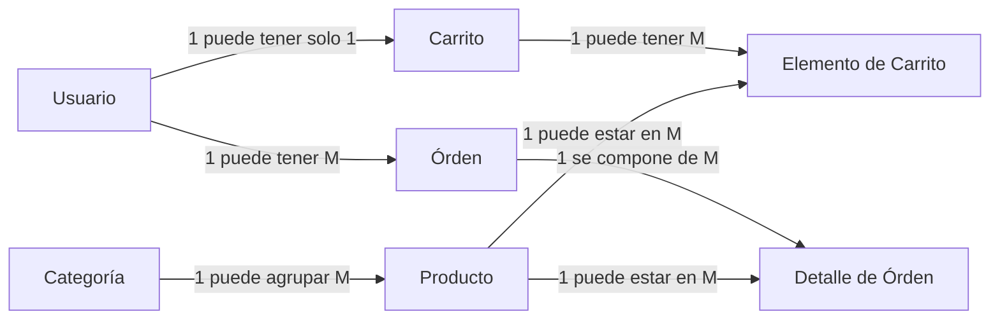

## Diagrama Entidad Relación (especificado)

#### **1 Usuario : 1 Carrito**
Un usuario solo puede tener un carrito activo a la vez.
#### **1 Usuario : M Órden**
Un usuario puede realizar múltiples compras/órdenes a lo largo del tiempo.

#### **1 Categoría : M Producto**
Una categoría agrupa varios productos.

#### **1 Carrito : M Elemento de Carrito**
Un carrito de compras contiene múltiples líneas (elementos) de productos.

#### **1 Órden : M Detalle de Órden**
Una orden de compra se compone de múltiples líneas de detalle.

#### **1 Producto : M Detalle de Órden**
Un producto puede estar en muchos carritos simultáneamente

#### **1 Producto : M Elemento de Carrito**
Un producto puede formar parte de muchas órdenes históricas.

## Mayor detalle de tablas
